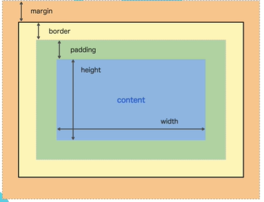

# CSS Properties
## Font Properties
- font
  - font-size
    - 1px = 1/96th of an inch (inch = 25.4mm)
    - 1pt = 1/72th of an inch 
    - 1em = 100% of the font-size of the parent element
      - Ex: 
      `body { font-size: 16px; }`
      `p { font-size: 2em; }` = 16px * 2
    - 1rem = 100% of the font-size of the root element (html element) 
  - font-weight
    - normal / bold (keywords)
    - lighter / bolder (relative to parent)
    - number (100-900)
  - font-family (Typeface)
    - Sans-Serif: base font with no serifs
    - Comma list: multiple fonts to use if first font doesn't work
    - Use double quotes for fonts with spaces
    - Use fonts.google.com to find free fonts to use
  - text-align
    - left / right / center / justify

## Box Model
- 
- border: thickness style color
  - Ex: 
  `p { border: 1px solid black; }`
  `h1 { border-bottom: 1px dotted blue; }`
  `p { border-width: 5px 5px 5px 5px; }`
- padding: top right bottom left
- margin: top right bottom left
- width
- height
- display
  - block / inline / inline-block
  - Ex: 
  `p { display: inline-block; }`
  `p { display: block; }`

## Content dividing
- 

: add a container to divide content

## Pesticide for Chrome
- Used to debug CSS