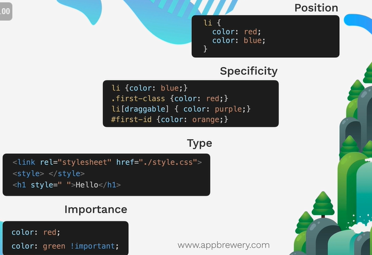

# The Cascade - Inheritance and Specificity
## Cascade order (less to more strong)

- Position
- Specificity
  - Element
  - Class
  - Attribute
  - ID
- Type
  - External
  - Internal
  - Inline
- Importance
  - !important

## Combining Selectors
- Group = apply the same style to multiple elements:
  Ex: `selector1, selector2 { property: value; }`
- Child = apply the same style to all elements that are a DIRECT child of the parent element:
  Ex: `selector > selector { property: value; }`
- Descedant = apply the same style to all elements that are a DESCENDANT of the parent element:
  Ex: `ancestor_selector descedant_selector { property: value; }`
- Chaining = apply where ALL selectors are true (used to specify a element):
  Ex: `selector1selector2 { property: value; }`
  - Prefer the order: element.class#id
- Combining Combiners
  Ex: `selector1 selector2selector3 { property: value; }`

## CSS Positioning
- Static: CSS default
- Relative: relative to its normal position
- Absolute: relative to the nearest positioned ancestor or top left corner of the webpage
  - z-index: stacking order
    Ex: `z-index: -1;` = behind other elements; `z-index: 0;` = in front of other elements; `z-index: 1;` = on top
- Fixed: relative to the viewport (top left corner of the browser window)
  - It ignores the scrollbars
- Sticky: relative to the nearest scrollable ancestor